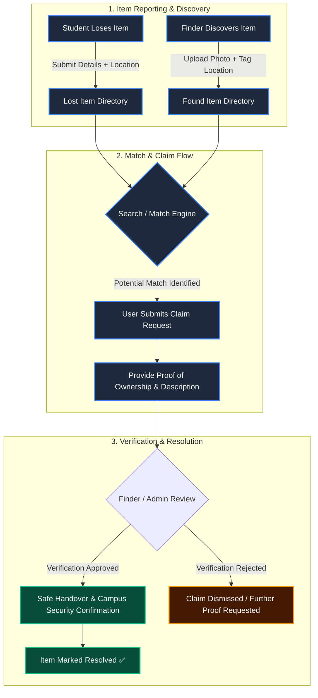
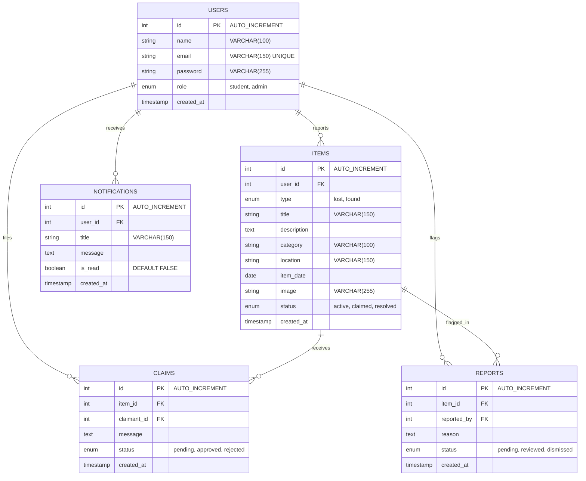

<div align="center">

# 🔍 FoundIt

### *Report. Search. Recover.*

**The modern, unified Lost & Found management portal built for campuses and communities.**

<br/>

[](https://react.dev/)
[](https://vitejs.dev/)
[](https://tailwindcss.com/)
[](https://www.mysql.com/)
[](https://lucide.dev/)
[](LICENSE)
[](CONTRIBUTING.md)

<br/>

[Explore Features](#-features) • [System Architecture](#-system-architecture) • [Database Schema](#-database-schema) • [Quick Start](#-quick-start) • [Role Matrix](#-roles--permissions) • [Roadmap](#-roadmap)

---

</div>

<br/>

## 📖 Overview

Lost belongings on campus often disappear into fragmented WhatsApp groups, bulletin boards, or unorganized reception desks. **FoundIt** revolutionizes campus item recovery by providing a **centralized, transparent, and verified ecosystem** for students, faculty, and campus security.

Whether you dropped your student ID near the library or found a wristwatch in the cafeteria, **FoundIt** streamlines reporting, match tracking, proof-of-ownership verification, and safe item reclamation in seconds.

<br/>

---

## ✨ Key Features

<table>
  <tr>
    <td width="50%" valign="top">
      <h3>🔍 Smart Search & Categorized Feed</h3>
      <ul>
        <li>Real-time keyword filtering across item titles, locations, and descriptions.</li>
        <li>Category breakdown: <i>Electronics, ID Cards, Bags, Books, Keys, Accessories</i>.</li>
        <li>Instant status filters: <code>Active</code>, <code>Claimed</code>, <code>Resolved</code>.</li>
      </ul>
    </td>
    <td width="50%" valign="top">
      <h3>📝 Streamlined Reporting Engine</h3>
      <ul>
        <li>Dedicated flows for <b>Report Lost</b> and <b>Report Found</b> items.</li>
        <li>Precision campus tagging (Academic Blocks, Hostels, Library, Cafeteria, Sports Complex).</li>
        <li>Image upload support with rich context notes and date tracking.</li>
      </ul>
    </td>
  </tr>
  <tr>
    <td width="50%" valign="top">
      <h3>🤝 Claim Verification & Proof Flow</h3>
      <ul>
        <li>Claimants submit private ownership proof and verification messages.</li>
        <li>Finders & campus admins review claims to prevent fraudulent collections.</li>
        <li>Item lifecycle management from submission to hand-off.</li>
      </ul>
    </td>
    <td width="50%" valign="top">
      <h3>🛡️ Security & Admin Control Center</h3>
      <ul>
        <li>Manage and moderate user accounts with role escalation & suspension controls.</li>
        <li>Review flagged reports and dispute logs with action tracking.</li>
        <li>Campus security item custody and resolution logging.</li>
      </ul>
    </td>
  </tr>
  <tr>
    <td width="50%" valign="top">
      <h3>🔔 Real-Time Notifications Hub</h3>
      <ul>
        <li>Automated alerts when matching items are logged nearby.</li>
        <li>Instant claim status updates (<code>Pending</code>, <code>Approved</code>, <code>Rejected</code>).</li>
        <li>Live unread badge indicators and activity logs.</li>
      </ul>
    </td>
    <td width="50%" valign="top">
      <h3>⚡ Pulse Statistics & Dashboard</h3>
      <ul>
        <li>Dynamic count-up animations for campus-wide active items and recoveries.</li>
        <li>Personalized user workspace to monitor submitted reports and claim history.</li>
        <li>Sleek, responsive glassmorphic UI styled with Tailwind CSS & custom design tokens.</li>
      </ul>
    </td>
  </tr>
</table>

<br/>

---

## 🔄 System Architecture & Lifecycle



<br/>

---

## 🗄️ Database Schema

The database is built on relational integrity with normalized tables, foreign key constraints, and cascading deletions to guarantee data consistency.



<br/>

---

## 👥 Roles & Permissions

| Feature / Action | Student / User | Faculty Member | Admin / Campus Security |
| :--- | :---: | :---: | :---: |
| **Browse & Search Listings** | ✅ | ✅ | ✅ |
| **Report Lost or Found Item** | ✅ | ✅ | ✅ |
| **Claim an Item & Provide Proof** | ✅ | ✅ | ✅ |
| **Manage Personal Reports & Claims** | ✅ | ✅ | ✅ |
| **Receive Real-Time Match Alerts** | ✅ | ✅ | ✅ |
| **Flag Inappropriate / Fake Listings** | ✅ | ✅ | ✅ |
| **Approve / Reject Claims (Finders)** | ✅ | ✅ | ✅ |
| **Direct Claim Override & Mediation** | ❌ | ❌ | ✅ |
| **Manage Users & Account Status** | ❌ | ❌ | ✅ |
| **Access Admin Dashboard & Analytics** | ❌ | ❌ | ✅ |

<br/>

---

## 🛠️ Technology Stack

| Layer | Technologies | Description |
| :--- | :--- | :--- |
| **Frontend Framework** | `React 19`, `Vite 8` | High-performance SPA with fast HMR and optimized asset bundling |
| **Routing & Navigation** | `React Router 7` | Declarative client-side routing with nested layouts (`Main`, `Auth`, `Dashboard`) |
| **Styling & Design System**| `TailwindCSS v4`, Vanilla CSS | Cyber-glassmorphic aesthetic, custom color tokens, smooth CSS transitions |
| **Icons & UI Assets** | `Lucide React` | Clean, lightweight icon suite for consistent visual language |
| **State & Context** | React Hooks & Context API | Centralized auth state, live counter hooks, mock data providers |
| **Database** | `MySQL 8.0` | Relational SQL schema with foreign keys, constraints, and cascading rules |

<br/>

---

## 📂 Project Structure

```text
FoundIt/
├── database/
│   └── schema.sql              # MySQL database schema (users, items, claims, notifications, reports)
├── frontend/
│   ├── public/                 # Static assets & public files
│   ├── src/
│   │   ├── assets/             # Images, logos, and illustrations
│   │   ├── components/         # Reusable UI components (Hero, Navbar, Badges, LiveStats, etc.)
│   │   ├── context/            # Global context (AuthContext, ThemeContext)
│   │   ├── data/               # Mock data feeds for instant local development
│   │   ├── hooks/              # Custom hooks (useLiveStats, useCountUp)
│   │   ├── layouts/            # Layout wrappers (MainLayout, AuthLayout, DashboardLayout)
│   │   ├── pages/              # Routed views (Home, LostItems, FoundItems, AdminDashboard, etc.)
│   │   ├── App.jsx             # Route definitions & app entry point
│   │   ├── index.css           # Global design system & token definitions
│   │   └── main.jsx            # React root mount
│   ├── package.json            # Frontend scripts & dependencies
│   └── vite.config.js          # Vite configuration
└── backend/                    # Backend API service directory
```

<br/>

---

## 🚀 Quick Start

Follow these steps to get your local development environment running in under 2 minutes:

### 1. Prerequisites
- **Node.js** `>= 18.x`
- **npm** `>= 9.x`
- **MySQL Server** `>= 8.0` *(optional for standalone frontend demo)*

<br/>

### 2. Clone and Setup Database

```bash
# Clone repository
git clone https://github.com/your-username/FoundIt.git
cd FoundIt

# (Optional) Initialize MySQL database
mysql -u root -p < database/schema.sql
```

<br/>

### 3. Setup and Launch Frontend

```bash
# Navigate to the frontend directory
cd frontend

# Install dependencies
npm install

# Start the Vite development server
npm run dev
```

Open your browser and navigate to:
```url
http://localhost:5173
```

<br/>

### 4. Build for Production

```bash
# Generate optimized production build
npm run build

# Preview production build locally
npm run preview
```

<br/>

---

## 🗺️ Roadmap

- [x] **Core Portal**: Responsive Lost & Found reporting and search directory.
- [x] **Verification Engine**: Claim workflow with ownership verification dialogue.
- [x] **Admin Suite**: User management, listing moderation, and report tracking.
- [x] **Live Notifications**: Match triggers and status updates.
- [ ] **AI Visual Matcher**: Automatic image similarity matching between lost & found photos.
- [ ] **QR Code Smart Tags**: Printable QR stickers for personal laptops, keys, and water bottles.
- [ ] **Interactive Campus Map**: Geotagged map view for lost & found item hotspots.
- [ ] **WhatsApp / Telegram Bot**: Direct chatbot reporting for quick mobile logging.

<br/>

---

## 🤝 Contributing

Contributions make the open-source community an inspiring place to learn, inspire, and create. Any contributions you make are **greatly appreciated**.

1. Fork the Project
2. Create your Feature Branch (`git checkout -b feature/AmazingFeature`)
3. Commit your Changes (`git commit -m 'Add some AmazingFeature'`)
4. Push to the Branch (`git push origin feature/AmazingFeature`)
5. Open a Pull Request

<br/>

---

## 📄 License

Distributed under the **MIT License**. See [`LICENSE`](LICENSE) for more information.

<div align="center">
  <br/>
  <sub>Built with ❤️ for safer, connected campuses.</sub>
</div>
